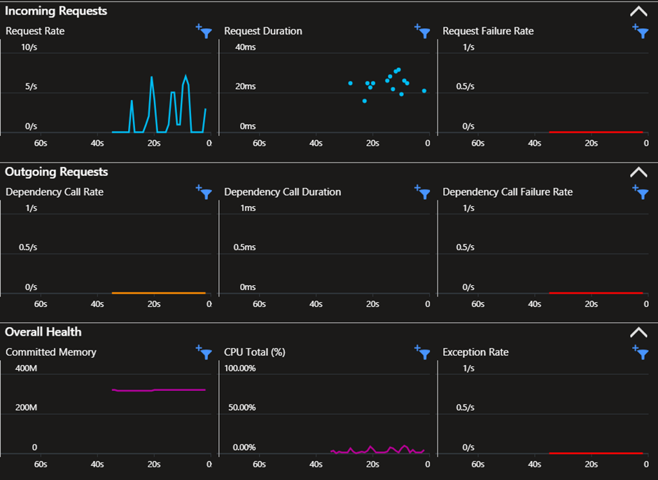
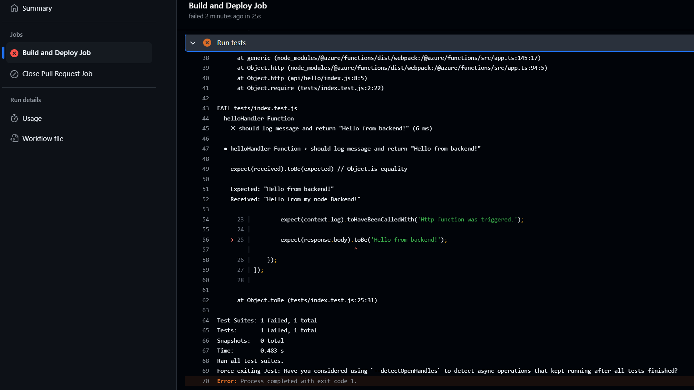
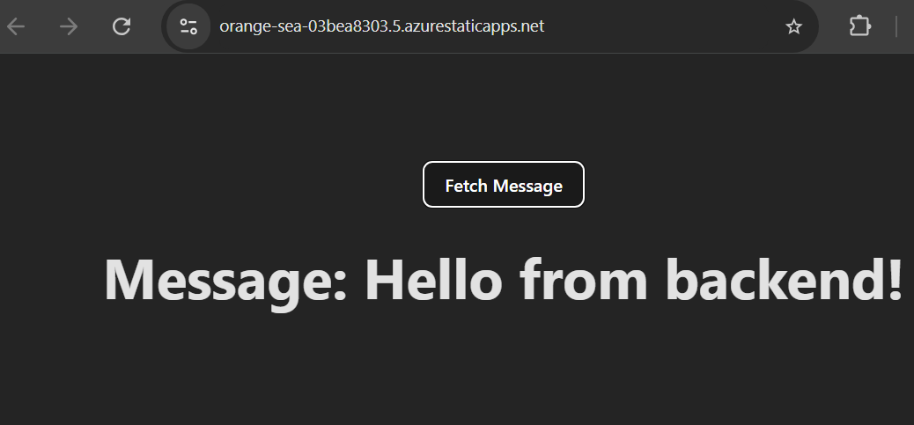
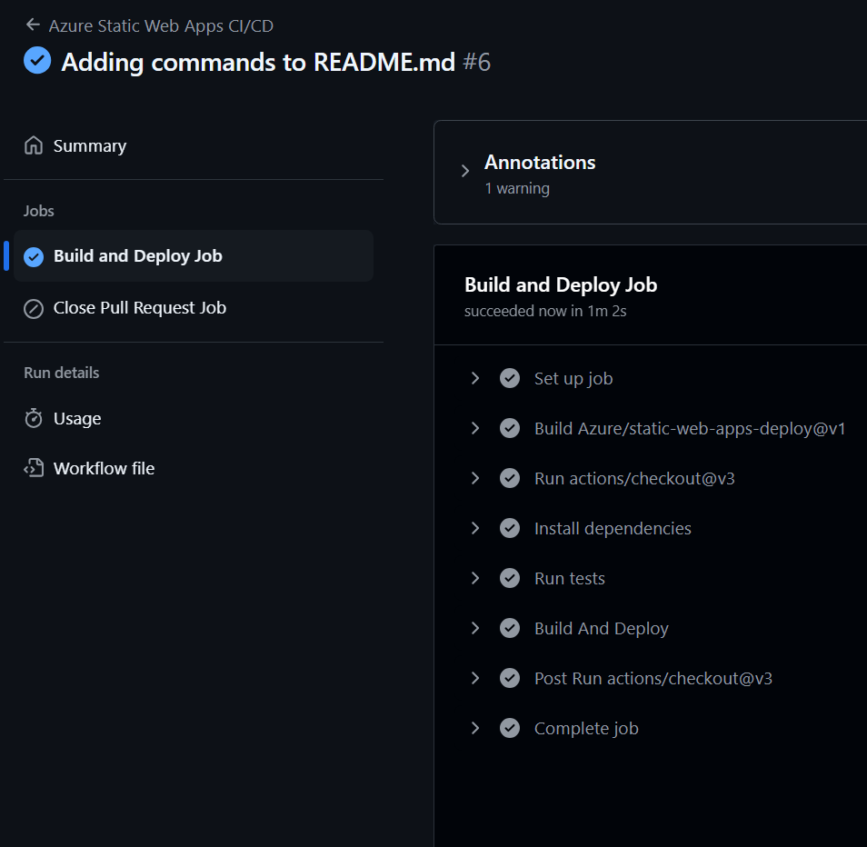
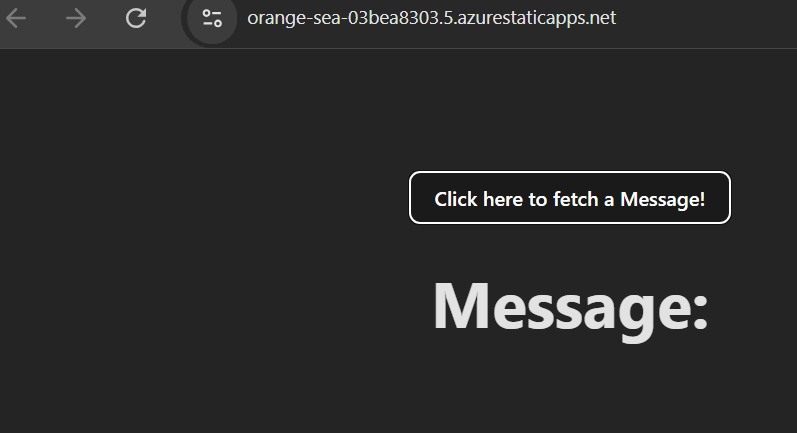
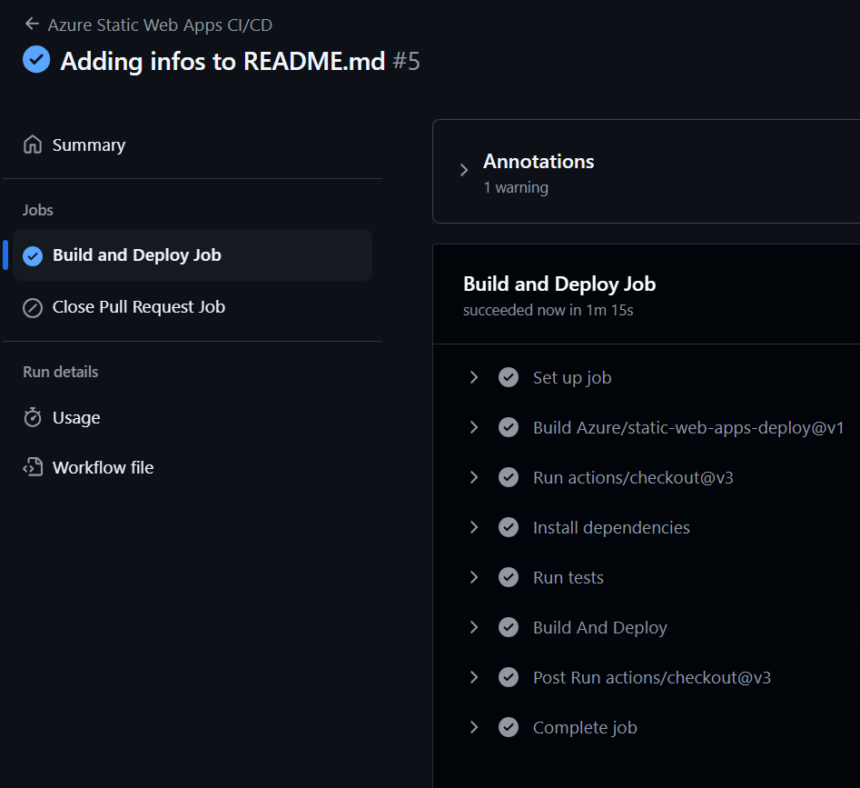
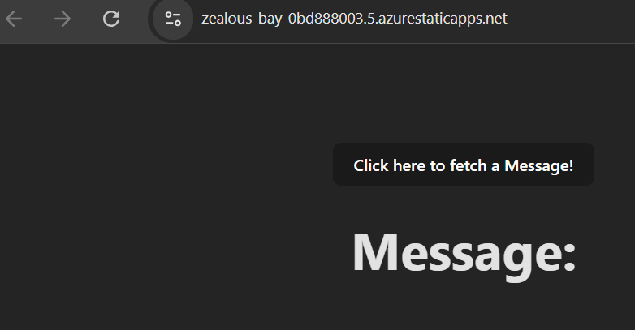

# software-deployment-lab-2
`author` : Michael Maximilian Werfring

`assignment` : Software Deployment Lab 2 
## Development
`resource-group` : swd-lab-2-app

`name` : swd-lab-2-app-dev

`url` : https://orange-sea-03bea8303.5.azurestaticapps.net

`branch` : main

`insights` : no

__Steps:__
* Install deps
* Run tests
* Build and Deploy

## Production
`resource-group` : swd-lab-2-app

`name` : swd-lab-2-app-prod

`url` : https://zealous-bay-0bd888003.5.azurestaticapps.net

`branch` : release

`insights` : yes

__Steps:__ 

* Install deps
* Run tests
* Build and Deploy

### Insights
`resource-group` : swd-lab-2-app

`name` : swd-lab-2-app-prod

The images shows azure insights on the production server, after sending requests consequetively for a few seconds.


## Releasing changes - The wrong way
This part describes the workflow for releasing changes to the application. 
For this example the text sent from the backend will be changed.
Firstly a faulty deployment will be simulated which is detected automatically by jest unit tests.

```
git branch new-text
git checkout new-text

...doing changes in /api/hello/index.js

git add .
git commit -m "Changing hello message on backend"
git checkout main 
git merge new-text
git push
```



It can be seen, that the text did not change when navigating to the development Website.



## Releasing changes - The correct way
This time the changes will be done to the frontend which is not tested curently. It will be assumed, that the faulty changes from the preceding step have been reverted by the developer.

```
git branch ui-improvements
git checkout ui-improvements

... doing changes

git add .
git commit -m "Improving Button text"
git checkout main
git merge ui-improvements
git push
```

When pushing main now, the deployment process will start and after a few minutes should look like the image below this in GitHub.




After verifying the changes in the dev Web App they can be deployed to production.


```
git checkout release
git merge main
git push
```
Now the Workflow will run and changes be in the prodction environment. 

