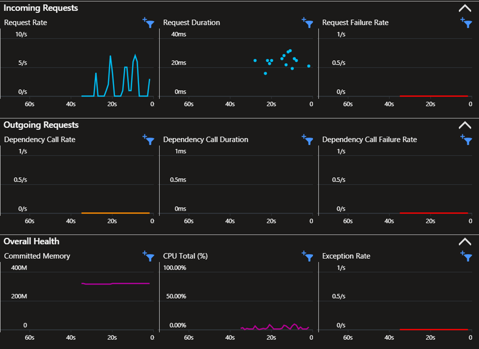

# software-deployment-lab-2
`author` : Michael Maximilian Werfring

`assignment` : Software Deployment Lab 2 
## Development
`resource-group` : swd-lab-2-app

`name` : swd-lab-2-app-dev

`url` : https://orange-sea-03bea8303.5.azurestaticapps.net

`branch` : main

`insights` : no

__Steps:__
* Install deps
* Run tests
* Build and Deploy

## Production
`resource-group` : swd-lab-2-app

`name` : swd-lab-2-app-prod

`url` : https://zealous-bay-0bd888003.5.azurestaticapps.net

`branch` : release

`insights` : yes

__Steps:__ 

* Install deps
* Run tests
* Build and Deploy

### Insights
`resource-group` : swd-lab-2-app

`name` : swd-lab-2-app-prod

The images shows azure insights on the production server, after sending requests consequetively for a few seconds.

## Releasing changes
This part describes the workflow for releasing changes to the application. 
For this example the text sent from the backend will be changed.
Firstly a faulty deployment will be simulated which is detected automatically by jes unit tests.
branch new-text
git checkout new-text